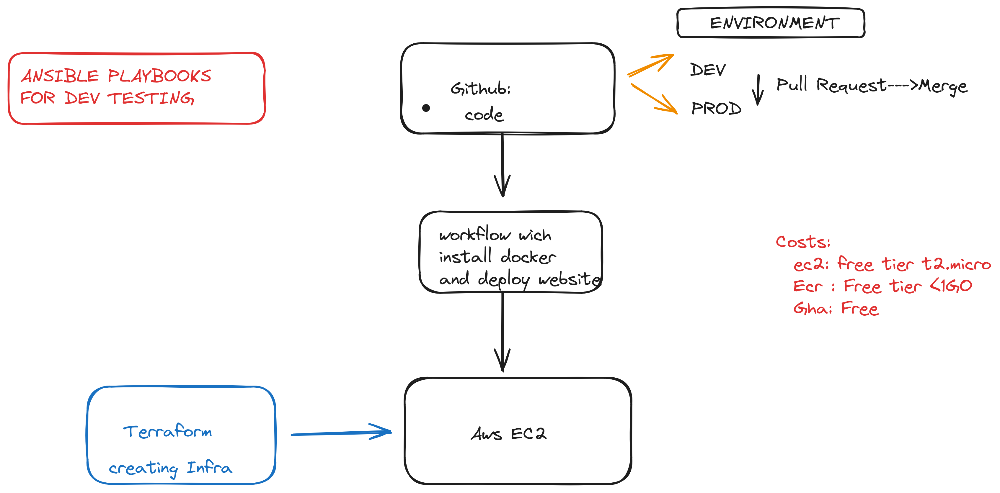

# Devops-Projects

# 1- 1-CICD-GHA-EC2

In this Project , we created an ec2 instance with default vpc
i added a sg to the infra
allowing ssh port and http port
i tried with ec2 user data but it doesn't work work , i did not wanna lose time i know it will be a silly thing that i missed 
as an output i get the ip address of the instance(with terraform i wanna use this output to inject it into github actions file to automatically know the @ip of the host )

2 / then i created cicd pipeline to build push and deploy container into the ec2 instance 
# using ansible playbook for dev testing 

# Multi Env Dev and Prod
now i will create and dev Env and then make Pull request to main branch for approuval or not.

I made pr from dev to prod 

then I Merged PR

# Adding Asg 
next step we gonna use an asg with loadbalancer and autoscaling group

